# Neural Msater extension for Automatic111 Web UI

The extension is a preprocessor and runs before the main SD loop.
The extension is compatible with all models, embeddings, controlnet models and other extensions to SD, 
since it does not concern their internal structure, but only prepares input images for SD.

The extension is most effective in combination with the blender add-on ['Neural Master'](https://neuralmaster.org/get_started),  
which automatically creates the correct masks for its operation.

## Installation of the extension

Use the standard procedure for installing extensions for Automatic 1111.

1. Click to the tab 'Extensions' in the top menu of Automatic 1111 Web UI.  
2. Click to the tab "Install from URL".  
3. Enter the URL of the extension: [https://github.com/neuralmaster/neuralmaster_inpainter.git](https://github.com/neuralmaster/neuralmaster_inpainter.git)  
4. Click 'Install' button.  
5. Click 'Apply and Restart UI'.

## Usage

1. Select the type of inpainting fill mode 'NeuralMaster'
2. Use a two-channel input mask, the format of which is described below.

**Notes**

Using the image editor in the Automatic 1111 web interface, it is impossible to create such a two-channel mask, however, it can be downloaded in the 'Inpaint upload' mode.
When using the Blender addon NauralMaster, the mask is created automatically.

## Problems

When using the inpainting mode, a pre-prepared image is fed to the SD input, in accordance with the specified inpainting mask and the value of 'Inpainting Fill' parameter.
That is, Inpainting Fill works as a preprocessor before SD operation.

There are 4 options for Inpainting Fill available in the Automatic1111 WebUI interface:  
- Fill  
- Original  
- Nothing  
- Noise  

Let's consider the application of each mode on a specific example of painting the texture of an apple using the Blender add-on 'Neural Master'.

### Source data

We will use the SD 1.5 model, the DPM++ 2M Keras sampler, as well as 3 Controlnet Units: Normal and Depth (to texture tits the 3d model) and IP Adapter to set the reference image.
As a reference image, we will use some image with an apple, the same in all cases.

The original 3d model looks like this:

First, we create a texture for the apple with a frontal camera using 'txt2img'.
The resulted image is:
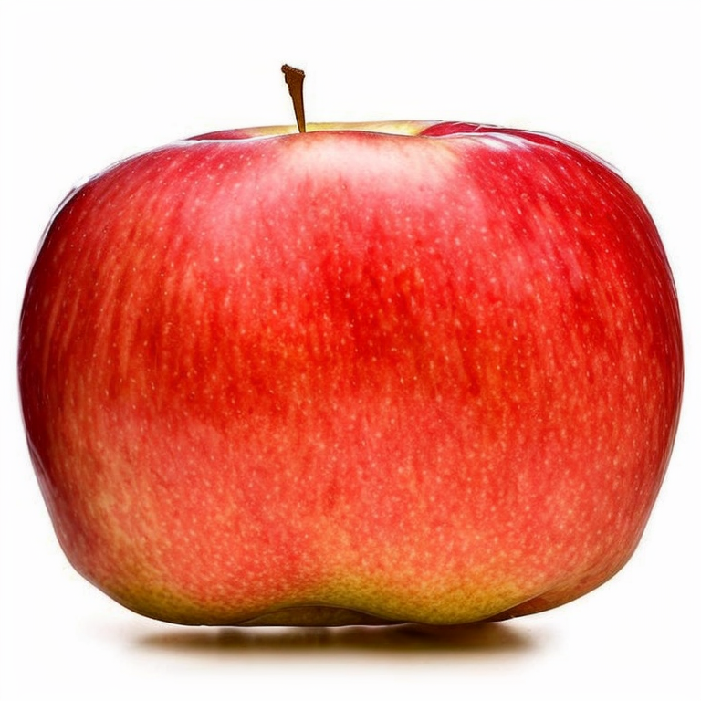

Fill the both (front and back) sides of the apple by this texture and turn the camera 90 degrees:
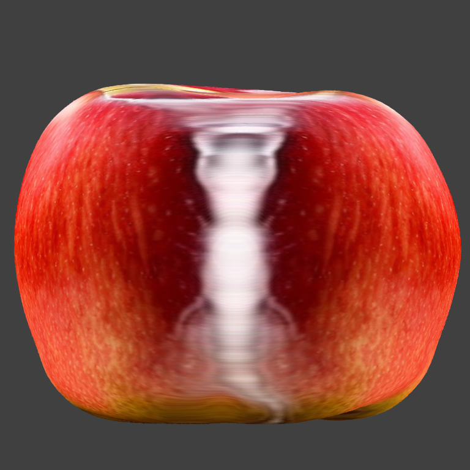

As we can see, the texture is very stretched, and in the central part it has absolutely incorrect white color.

We will try to finish painting this texture in the inpainting mode with two different mask.

Binary mask:
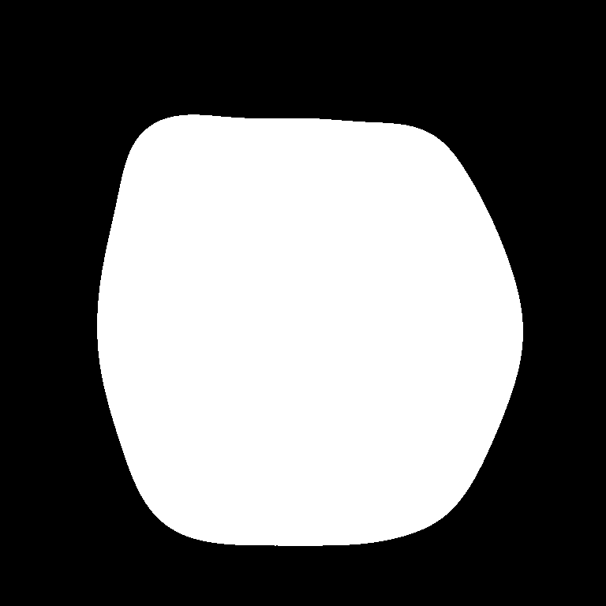

The smoothed mask:

(Masks are generated automatically in the NeuralMaster Blender Addon with default settings).

### Original Mode

The **Original** mode does not modify the image before feeding it to the SD input.

That is, the same input image is fed to the SD input:

The latent representation of which looks like this:

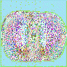 (Binary mask)

 (Smoothed mask)

As a result of the input, we get:

When using a binary mask:

When using a smoothed mask:
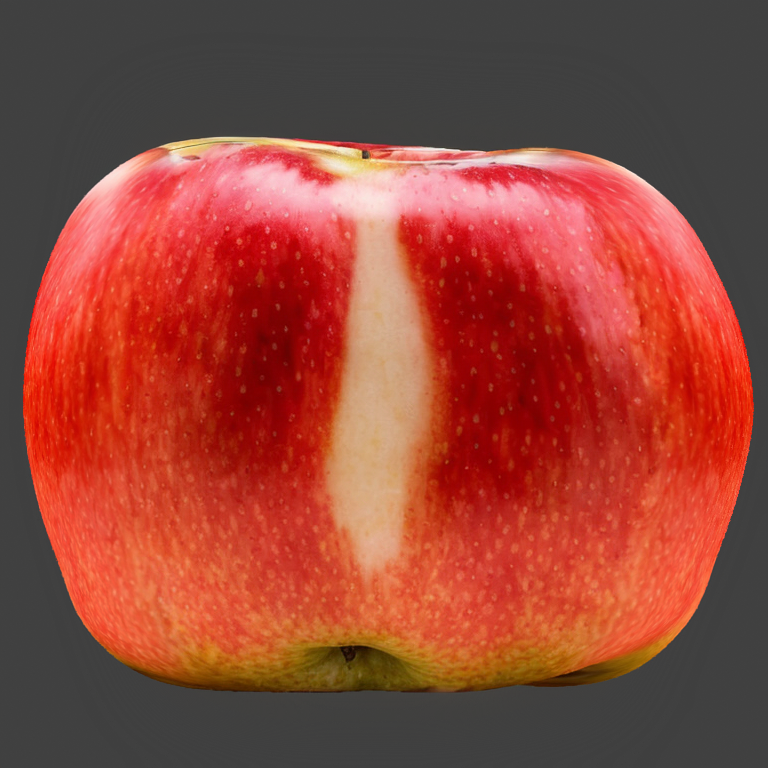

This mode is great if the image you want to finish is already approximately similar to the desired result, and it needs to be improved.
In our example, we get a fail because SD tries to embed a wide white stripe in the middle into the picture.

### Fill Mode

The **Fill** mode fills the image in the input area with some average color of the image (excluding the input area) and feeds it to the SD input.
Thus, at the output of the Fill preprocessor, we get an image:

When using a binary mask:
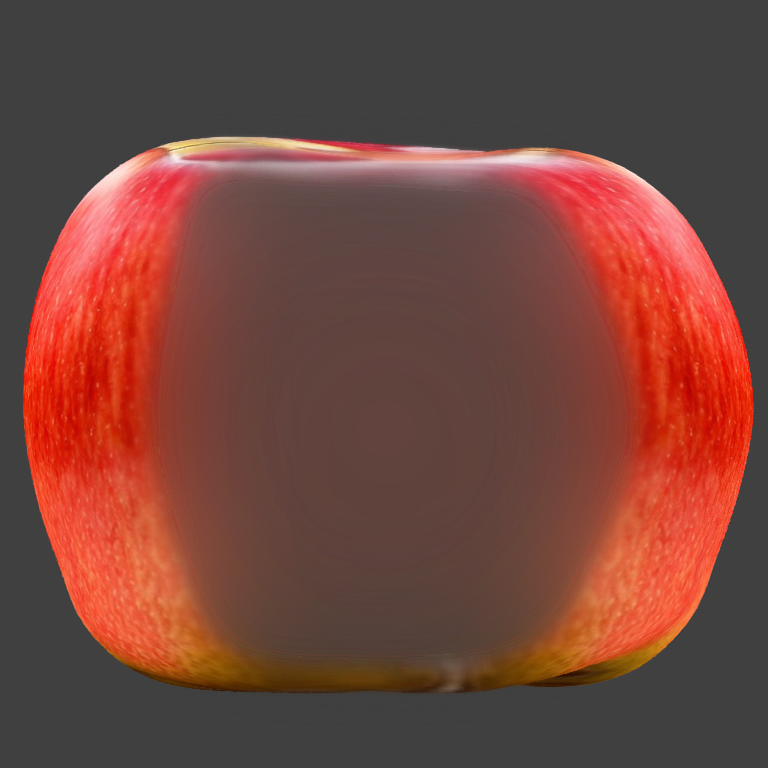

When using a smoothed mask:

The latent representation of which looks like this:
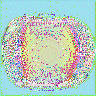 (Binary mask)
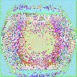 (Smoothed mask)

As a result of the generation, we get an image:

When using a binary mask:

When using a smoothed mask:
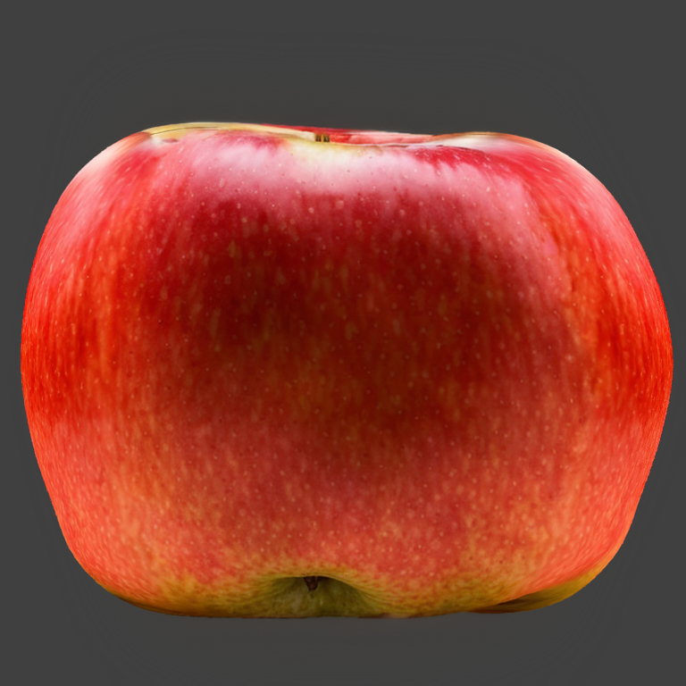

The image has a dark gray tint, because the average color of the image takes into account the dark gray background color, and not only the color of the useful object - the apple.

As a result, the image after the input is also unsatisfactory.

### Nothing Mode

In this mode, the latent  of the image is filled with a neutral color, which looks like this:

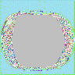 - binary mask
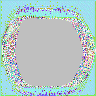 - smoothed mask

As a result of the generation, we get images that are also not of satisfactory quality

When using a binary mask:
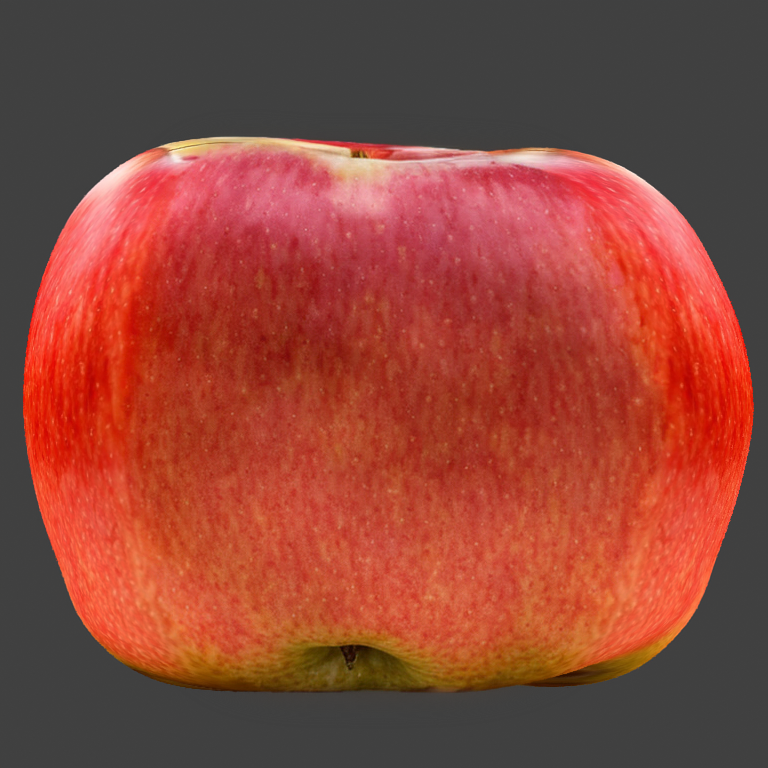

When using a smoothed mask:
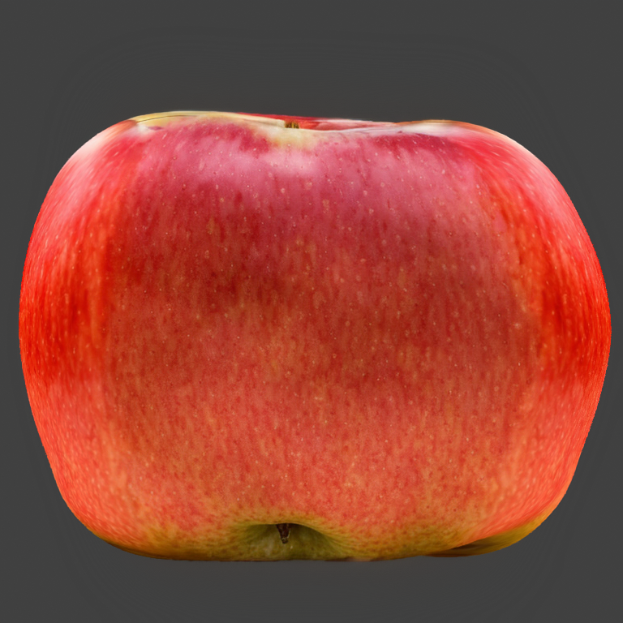

### Noise Mode

The preprocessor **Noise** floods the image in the latent representation with some random noise, which looks like this:

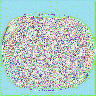 - binary mask
 - smoothed mask

Usually, this gives something completely terrible, however, in this case, thanks to the IP Adapter, the result is not so bad, but also not satisfactory.

When using a binary mask:
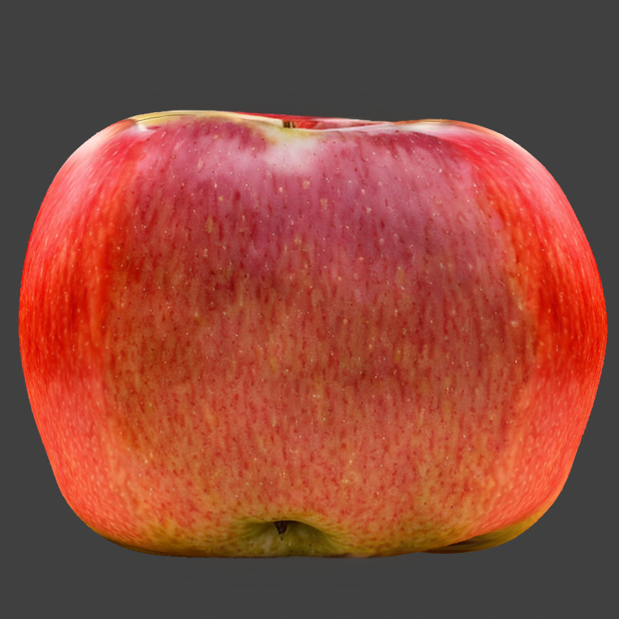

When using a smoothed mask:
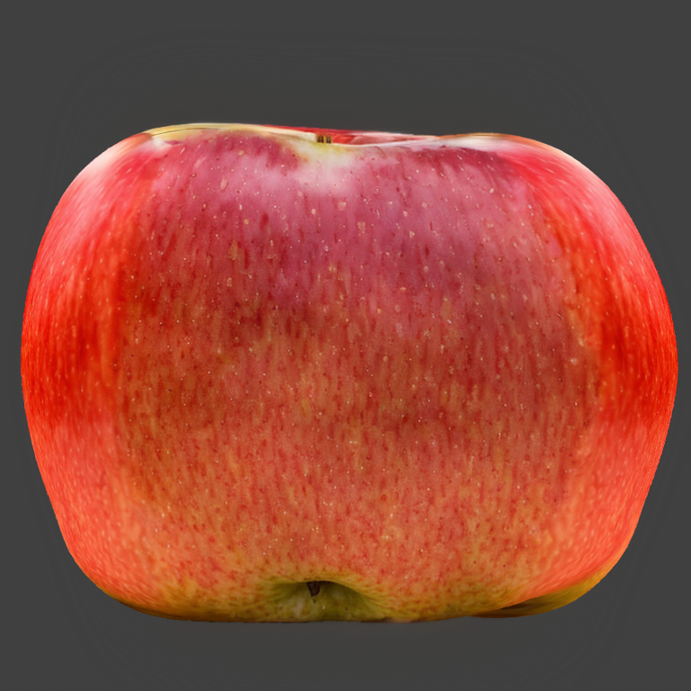

### Conclusion of the experiment

The best result can be achieved by the 'Original' modes (which provides the best joint) and Fill (which uses the context), but they have disadvantages:

1. 'Fill' uses an unnecessary background color when filling, not just the color of the useful object.

2. 'Original' uses the incorrect original color because it includes background color.

## NauralMaster mode

The new 'NeuralMaster' inpaint mode is designed to correct the listed weak points by filling the inpoint area with a context-dependent image, but more advanced:

1. Not the entire space of the image is used for filling, but only the useful part of it, set by an additional mask.
2. After creating a context-based mask, it is combined with the original image using a gradient mask.

### Input mask format of the input

A two-channel input mask is used.

1. Channel 0 (red) contains an input mask that defines the area of the paint. This mask is similar to the classic inpainting mask, but it is not just binary, but gradient, which is necessary for the operation of the second feature listed above.

2. Channel 1 (green) contains a mask of a useful image, the average value of which will fill the image in the input area, which allows you to ignore the background color.

### Example of the mode operation

Let's look at the operation of the mode using the same example - texturing an apple.

The input mask looks like this.  
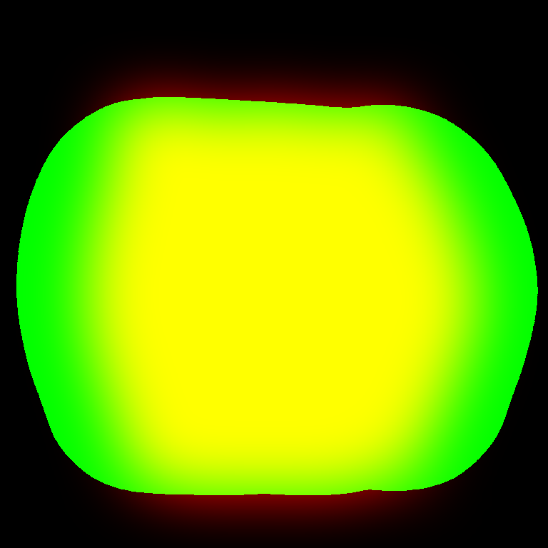

Here the masks are combined into one image, as written above. Here's how its individual channels will work:

Channel 0 (red) - input mask (matches the smoothed mask used above):
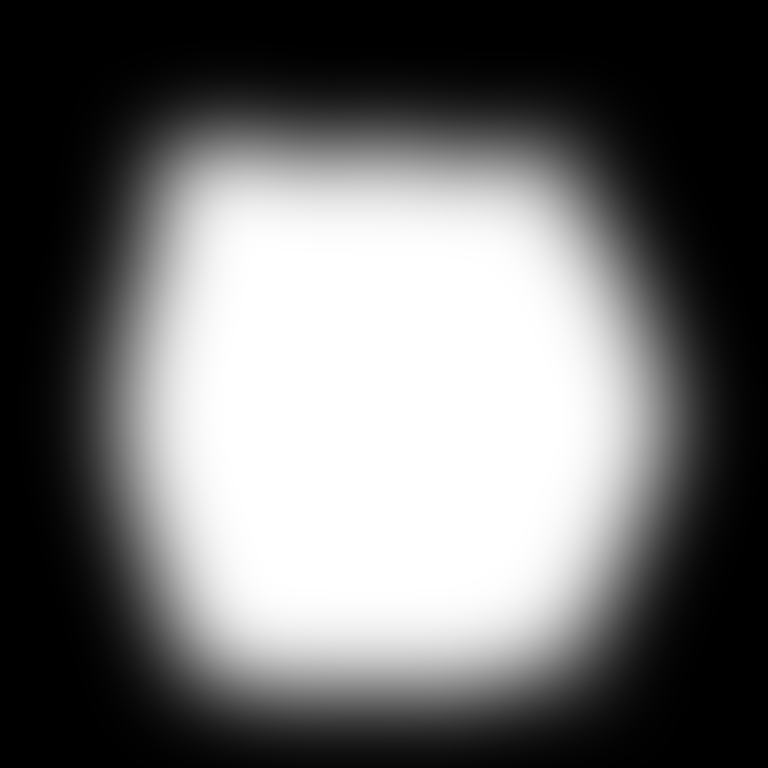

Channel 1 (green) mask of the useful object:
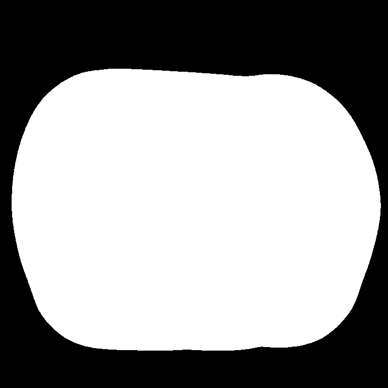

The external mask highlights only a useful object, in this case, an apple.

Here, both masks are generated automatically using the Naural Maaster add-on for the blender, but it can also be created using other tools.

With the help of these masks and their input image, a matching image is obtained, which is fed to the SD input:
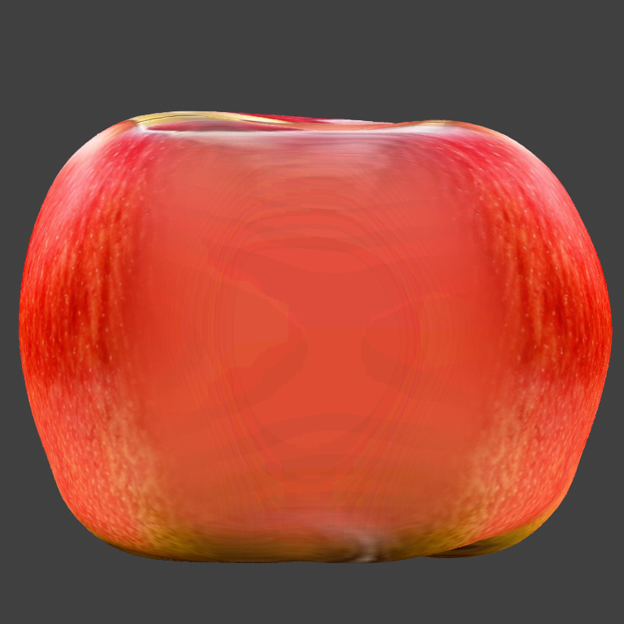

As you can see, at the periphery of the input mask, in the area of its gradient, the image matches the original one,
and the center it is filled with red, the middle color of the apple.

The latent representation of this image is:  
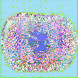

The result of the generation is: 
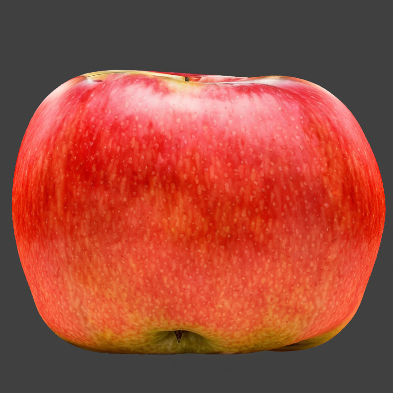

As you can see, this result turned out to be the highest quality.
Moreover, this result is consistently reproduced when using different Seed values.

**Notes**

1. If the red and green channels of the input mask match, the Original mode is used, and the following warning is displayed in the console.
2. Theoretically, the expansion can give some effect even without using the second channel, only due to the gradient mask. However, this option is currently not used.
